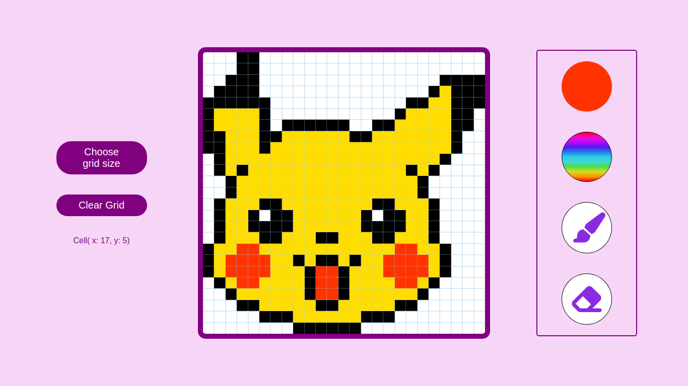

# Etch-a-sketch 	:art: 

A simple pixel art editor made with HTML, CSS, and JavaScript.

## About 

"Etch-a-sketch" is a simple grid based pixel art editor capable of dynamically generating different grid sizes based on user input.

